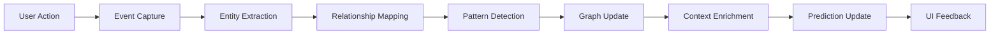

# Intelligent Memory Layer Architecture
**Version:** 1.0  
**Date:** September 20, 2025  
**Status:** Proposed Architecture

## Executive Summary

This document outlines the architecture for transforming Legacy Compass's current storage-based memory system into an active, intelligent memory layer that learns from user interactions, predicts behaviors, and provides contextual intelligence for real estate prospecting.

## Problem Statement

Current limitations in Legacy Compass v5.3:
- Memory is passive storage rather than active intelligence
- No relationship mapping between properties or owners
- Limited context awareness beyond individual property isolation
- Ghost AI doesn't leverage accumulated knowledge proactively
- Missing predictive and suggestive capabilities based on historical patterns

## Proposed Solution

Transform the existing memory infrastructure into a three-tier intelligent system that actively learns, relates, and predicts based on accumulated context across all user interactions.

## Architecture Overview

### 1. Three-Tier Memory System

```
┌─────────────────────────────────────────────┐
│          HOT MEMORY (Immediate)             │
│   • Current property context                │
│   • Active conversations                    │
│   • Recent notes & activities               │
│   Storage: React State + IndexedDB          │
│   Latency: 0-10ms                          │
└─────────────────────────────────────────────┘
                    ↕
┌─────────────────────────────────────────────┐
│          WARM MEMORY (Working)              │
│   • 30-day interaction patterns             │
│   • Property relationships                  │
│   • Owner behavior models                   │
│   Storage: FalkorDB Graph                   │
│   Latency: 50-100ms                        │
└─────────────────────────────────────────────┘
                    ↕
┌─────────────────────────────────────────────┐
│          COLD MEMORY (Long-term)            │
│   • Historical summaries                    │
│   • Market cycles & trends                  │
│   • Success/failure patterns                │
│   Storage: Supabase + Vector DB             │
│   Latency: 100-500ms                       │
└─────────────────────────────────────────────┘
```

### 2. Graph-Based Knowledge Model

```
Property Node {
    id: UUID
    address: String
    metadata: JSON
    embedding: Vector[1536]
    
    Edges:
    ├── TEMPORAL → Historical States
    ├── SPATIAL → Nearby Properties
    ├── OWNERSHIP → Owner/LLC Entities
    ├── MARKET → Similar Properties
    ├── INTERACTION → User Activities
    └── PREDICTION → Likely Outcomes
}

Person Node {
    id: UUID
    name: String
    contact: JSON
    behavior_profile: JSON
    
    Edges:
    ├── OWNS → Properties
    ├── CONTACTED → Interaction History
    ├── RESPONDED → Response Patterns
    └── TRANSACTED → Deal Outcomes
}

Context Node {
    id: UUID
    type: Enum[market, seasonal, economic]
    data: JSON
    
    Edges:
    ├── INFLUENCES → Properties
    └── CORRELATES → Other Contexts
}
```

### 3. Memory Processing Pipeline



## Core Components

### 3.1 Context Preloader

**Purpose:** Instantly hydrate property view with relevant context

```typescript
interface PropertyContext {
    immediate: {
        recentNotes: Note[]
        activeConversation: Message[]
        lastInteraction: Date
    }
    relationships: {
        sameOwner: Property[]
        nearbyProperties: Property[]
        similarProperties: Property[]
    }
    patterns: {
        ownerBehavior: BehaviorProfile
        marketTrends: TrendData
        successRate: number
    }
    predictions: {
        nextActions: SuggestedAction[]
        dealProbability: number
        optimalStrategy: Strategy
    }
}
```

**Implementation Flow:**
1. Property selection triggers preload
2. IndexedDB returns immediate context (0ms)
3. GraphQL fetches relationships from FalkorDB (50ms)
4. Pattern matcher finds similar past interactions (100ms)
5. Context package sent to Ghost AI before first message
6. UI displays context badges and suggestions

### 3.2 Relationship Engine

**Purpose:** Maintain and traverse property/person relationships

**Core Relationships:**
- **Ownership Chains:** Track LLC structures, property portfolios
- **Geographic Clusters:** Street-level, neighborhood patterns
- **Behavioral Patterns:** Response rates, negotiation styles
- **Market Dynamics:** Price movements, inventory patterns

**Query Examples:**
```graphql
# Find related properties for context
query GetPropertyContext($propertyId: ID!) {
    property(id: $propertyId) {
        relatedByOwner {
            address
            lastInteraction
            dealStatus
        }
        nearbyProperties(radius: 0.5) {
            address
            marketActivity
        }
        similarProperties(limit: 10) {
            address
            successRate
            averageTimeToClose
        }
    }
}
```

### 3.3 Pattern Recognition System

**Purpose:** Detect and learn from recurring patterns

**Pattern Types:**
- **Temporal:** Best times to contact, seasonal patterns
- **Behavioral:** Owner response patterns, negotiation tactics
- **Market:** Price elasticity, inventory cycles
- **Success:** What works for similar properties/owners

**Learning Pipeline:**
```python
class PatternLearner:
    def extract_features(self, interaction):
        # Extract relevant features from interaction
        return features
    
    def update_model(self, features, outcome):
        # Update pattern model with new data
        self.model.partial_fit(features, outcome)
    
    def predict_next_action(self, context):
        # Suggest next best action based on patterns
        return self.model.predict(context)
```

### 3.4 Intelligence Accumulator

**Purpose:** Build long-term intelligence from daily interactions

**Daily Processing:**
- Compress conversations into summaries
- Extract entities and relationships
- Update behavior models
- Calculate success metrics

**Weekly Analysis:**
- Market movement detection
- Portfolio pattern analysis
- Strategy effectiveness review
- Automated insight generation

**Monthly Intelligence:**
- Trend identification
- Predictive model retraining
- Success pattern documentation
- Strategic recommendations

## Integration Points

### 4.1 Frontend Integration

```typescript
// Enhanced PropertyDetailView
export function PropertyDetailView({ property }) {
    const memory = useIntelligentMemory(property.id);
    
    return (
        <>
            <MemoryBadges context={memory.immediate} />
            <RelationshipGraph nodes={memory.relationships} />
            <PredictiveActions suggestions={memory.predictions} />
            <PatternInsights patterns={memory.patterns} />
        </>
    );
}

// Memory Hook
export function useIntelligentMemory(propertyId: string) {
    const [memory, setMemory] = useState<PropertyContext>();
    
    useEffect(() => {
        // Parallel fetch all memory tiers
        Promise.all([
            fetchHotMemory(propertyId),
            fetchWarmMemory(propertyId),
            fetchColdMemory(propertyId)
        ]).then(([hot, warm, cold]) => {
            setMemory(mergeMemoryTiers(hot, warm, cold));
        });
    }, [propertyId]);
    
    return memory;
}
```

### 4.2 Ghost AI Enhancement

```python
# Enhanced Agent Zero Context Tool
@tool("get_property_intelligence")
def get_property_intelligence(property_id: str) -> dict:
    """
    Retrieves comprehensive intelligence for a property
    including relationships, patterns, and predictions.
    """
    
    # Fetch multi-tier memory
    hot_memory = fetch_immediate_context(property_id)
    warm_memory = query_falkordb_relationships(property_id)
    cold_memory = retrieve_historical_patterns(property_id)
    
    # Generate predictions
    predictions = predict_next_actions(
        property_id, 
        hot_memory, 
        warm_memory
    )
    
    return {
        "current_context": hot_memory,
        "relationships": warm_memory,
        "historical_patterns": cold_memory,
        "predictions": predictions,
        "recommended_strategy": generate_strategy(property_id)
    }

# Auto-inject context before responses
@before_response
def inject_property_context(message: Message):
    if message.property_id:
        context = get_property_intelligence(message.property_id)
        message.context = context
```

### 4.3 API Endpoints

```typescript
// Memory API Routes
app.post('/api/memory/preload', async (req, res) => {
    const { propertyId } = req.body;
    const context = await preloadPropertyContext(propertyId);
    res.json(context);
});

app.get('/api/memory/relationships/:propertyId', async (req, res) => {
    const relationships = await findPropertyRelationships(
        req.params.propertyId
    );
    res.json(relationships);
});

app.get('/api/memory/patterns/:userId', async (req, res) => {
    const patterns = await detectUserPatterns(req.params.userId);
    res.json(patterns);
});

app.post('/api/memory/predict', async (req, res) => {
    const { propertyId, context } = req.body;
    const predictions = await predictNextActions(propertyId, context);
    res.json(predictions);
});

app.post('/api/memory/learn', async (req, res) => {
    const { interaction, outcome } = req.body;
    await updateLearningModels(interaction, outcome);
    res.json({ success: true });
});
```

## User Experience Enhancements

### 5.1 Context-Aware UI Components

**Memory Timeline:**
- Visual timeline of all property interactions
- Filterable by type (notes, calls, visits)
- Sentiment coloring (positive/negative/neutral)

**Relationship Web:**
- Interactive graph visualization
- Click to navigate between related properties
- Highlight ownership chains and patterns

**Prediction Cards:**
- "Based on 47 similar properties, call between 4-6pm"
- "Owner typically responds after 2nd contact"
- "Properties like this close in 45-60 days"

**Smart Suggestions:**
- "3 nearby properties with same owner"
- "Market heating up - 5 similar properties sold this week"
- "Try email - this owner responds 73% to email vs 22% to calls"

### 5.2 Contextual Ghost Chat

When starting a Ghost chat, automatically prime with:
- Last 3 interactions summary
- Related property information
- Owner behavior profile
- Market context
- Suggested talking points

Example Ghost priming:
```
Context Package for 123 Main St:
- Last contacted: 5 days ago (no response to call)
- Owner has 3 other properties (2 responded to email)
- Similar properties selling 15% above asking
- Seasonal pattern: September has 67% response rate
- Suggestion: Email with comp analysis focus
```

## Implementation Roadmap

### Phase 1: Foundation (Week 1-2)
- [ ] Extend FalkorDB schema for relationships
- [ ] Build entity extraction pipeline
- [ ] Create relationship mapping tools
- [ ] Implement basic pattern detection

### Phase 2: Intelligence Layer (Week 3-4)
- [ ] Develop pattern recognition algorithms
- [ ] Build prediction models
- [ ] Create learning pipeline
- [ ] Implement context preloading

### Phase 3: Integration (Week 5-6)
- [ ] Enhance Ghost AI with context tools
- [ ] Build memory API endpoints
- [ ] Create React hooks for memory access
- [ ] Implement background processing jobs

### Phase 4: User Experience (Week 7-8)
- [ ] Design and build memory UI components
- [ ] Add relationship visualizations
- [ ] Implement predictive suggestions
- [ ] Create context-aware navigation

## Performance Considerations

### Latency Targets:
- Hot memory access: <10ms
- Relationship queries: <100ms
- Pattern matching: <200ms
- Full context preload: <500ms

### Optimization Strategies:
- Aggressive caching in IndexedDB
- GraphQL query batching
- Lazy loading for cold memory
- Background prefetching for likely next properties

### Storage Requirements:
- Hot memory: ~1MB per 100 properties
- Graph relationships: ~10MB per 1000 properties
- Pattern models: ~50MB total
- Historical summaries: ~100KB per property

## Success Metrics

### Technical Metrics:
- Context preload latency <500ms
- Pattern detection accuracy >80%
- Prediction relevance score >70%
- Memory retrieval success rate >99%

### Business Metrics:
- 30% reduction in time to first contact
- 25% improvement in response rates
- 40% faster deal closure for predicted strategies
- 50% reduction in repeated failed approaches

## Security & Privacy

### Data Protection:
- All PII remains encrypted in IndexedDB
- Graph relationships use hashed identifiers
- Pattern models trained on anonymized data
- User-specific models isolated per account

### Access Control:
- Memory access scoped to user ID
- No cross-user relationship traversal
- Audit logging for all memory operations
- GDPR-compliant data retention policies

## Future Enhancements

### Version 2.0 Possibilities:
- Voice-activated memory queries
- AR property visualization with context overlay
- Multi-agent collaboration on complex deals
- Automated outreach based on predictions
- Market-wide intelligence sharing (anonymized)

### AI Model Evolution:
- Fine-tuned LLMs for real estate context
- Custom embeddings for property similarity
- Reinforcement learning from deal outcomes
- Federated learning across user base

## Conclusion

The Intelligent Memory Layer transforms Legacy Compass from a property management tool into a learning system that actively helps users succeed. By leveraging existing infrastructure (IndexedDB, Supabase, FalkorDB) and adding intelligence layers, we create a system that remembers, learns, and predicts - becoming more valuable with every interaction.

**Next Steps:**
1. Review and approve architecture
2. Prioritize Phase 1 features
3. Set up development environment
4. Begin FalkorDB schema extension
5. Start entity extraction pipeline

---

*Document Status: Proposed Architecture awaiting approval*  
*Author: System Architecture Team*  
*Last Updated: September 20, 2025*